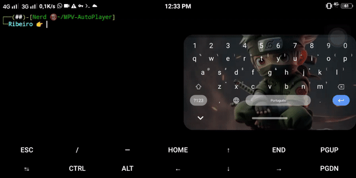

# Music Player Script

This script uses `mpv` to play a music file. If the user does not provide a path to a music file, a default music file will be played.

## Requirements

- `mpv` must be installed. The script will check if `mpv` is installed and will install it if necessary.


## Usage

```bash

./music_player.sh [path_to_music_file]

#### Note
- If you want to stop music just click `q` or `ctrl + c`
